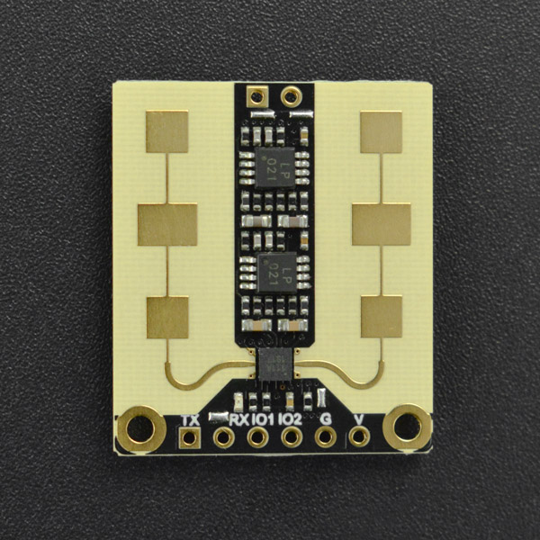

# DFRobot_C4001
- [中文版](./README_CN.md)

Determine whether the human body exists, and its anti-interference ability is relatively strong, and it is not easy to be affected by factors such as temperature changes, environmental light changes and environmental noise. Whether the human body is sitting, sleeping or moving, the sensor can quickly and sensitively detect its presence.



## Product Link(https://www.dfrobot.com/product-2282.html)

    SKU：SEN0609 SEN0610

## Table of Contents

* [Summary](#Summary)
* [Installation](#Installation)
* [Methods](#Methods)
* [Compatibility](#Compatibility)
* [History](#History)
* [Credits](#Credits)

## Summary

Provides an Arduino library that has the following features:
  Get whether the human body exists
  Get some state of motion of the object

## Installation
1. Download the library to Raspberry Pi first before use.

```
sudo git clone https://github.com/DFRobot/DFRobot_C4001
```

1. Open and run the routine. To execute a routine demo_x.py, enter python demo_x.py in the command line. For example, to execute the routine get_mm wavewave.py, you need to enter:

```
python motion_range_velocity.py
or 
python2 motion_range_velocity.py
or 
python3 motion_range_velocity.py
```

## Methods

```python
  def begin(self):
  '''!
    @brief begin 
  '''

  def get_status(self):
  '''!
    @brief get_status
    @return status
  '''

  def motion_detection(self):
  '''!
    @brief motion_detection
    @return status
    @retval 0 no exist
    @retval 1 exist
  '''

  def set_sensor_mode(self, mode):
  '''!
    @brief set_sensor_mode
    @param mode 
    @n  SPEED_MODE
    @n  EXIST_MODE
  '''

  def set_trig_sensitivity(self, sensitivity):
  '''!
    @brief set_trig_sensitivity
    @param sensitivity 0-9
  '''
    
  def get_trig_sensitivity(self):
  '''!
    @brief get_trig_sensitivity
    @return sensitivity 0-9
  '''

  def set_keep_sensitivity(self, sensitivity):
  '''!
    @brief set_keep_sensitivity
    @param sensitivity 0-9
  '''

  def get_keep_sensitivity(self):
  '''!
    @brief get_keep_sensitivity
    @return sensitivity 0-9
  '''

  def set_delay(self, trig, keep):
  '''!
    @brief set_delay
    @param trig (0-200)
    @n     Trigger delay, i2c mode unit 10ms range (0 ~200) (0s-2.0s)
    @n     Trigger delay, uart mode unit 500ms range (0 ~200) (0s-100.0s)
    @param keep (4~3000) (2s-1500s)
  '''

  def get_trig_delay(self):
  '''!
    @brief get_trig_delay
    @return trig
  '''
    
  def get_keep_timerout(self):
  '''!
    @brief get_keep_timerout
    @return keep timerout
  '''

  def set_detection_range(self, min, max):
  '''!
    @brief set_detection_range
    @param min (30-2000)
    @param max (240~2000)
    @n min not more than max, otherwise the function is not normal.
  '''

  def get_trig_range(self):
  '''!
    @brief get_trig_range
    @return trig range
  '''

  def get_max_range(self):
  '''!
    @brief get_max_range
    @return max range
  '''

  def get_min_range(self):
  '''!
    @brief get_max_range
    @return min range
  '''

  def get_target_number(self):
  '''!
    @brief get_target_number
    @return target number 
  '''

  def get_target_speed(self):
  '''!
    @brief get_target_speed
    @return target speed
  '''

  def get_target_range(self):
  '''!
    @brief get_target_range
    @return target range
  '''

  def get_target_energy(self):
  '''!
    @brief get_target_energy
    @return target energy
  '''

  def set_detect_thres(self, min, max, thres):
  '''!
    @brief set_detect_thres
    @param min 0-2500
    @param max 0-2500
    @param thres 0-65535
  '''

  def set_io_polaity(self, value):
  '''!
    @brief set_io_polaity
    @param value 0 or 1
    @n   0: Low output when there is a target, high output when there is no target
    @n   1: Output high when there is a target, output low when there is no target (default state)
  '''

  def get_io_polaity(self):
  '''!
    @brief get_io_polaity
    @return io status
  '''

  def set_pwm(self, pwm1, pwm2, timer):
  '''!
    @brief set_pwm
    @param pwm1 Duty cycle of the output signal of the OUT pin when the target is not detected. The value ranges from 0 to 100
    @param pwm2 Duty cycle of the output signal of the OUT pin after the target is detected. The value ranges from 0 to 100
    @param Time from pwm1 duty cycle to pwm2 duty cycle. The value ranges from 0 to 255, corresponding to the time value = timer*64ms
    @n     For example, timer=20, it takes 20*64ms=1.28s for duty cycle to change from pwm1 to pwm2.
  '''

  def get_pwm(self):
  '''!
    @brief get_pwm
    @return pwm value
  '''
    
  def get_tmin_range(self):
  '''!
    @brief get_tmin_range
    @return speed mode min range
  '''

  def get_tmax_range(self):
  '''!
    @brief get_tmax_range
    @return speed mode max range
  '''

  def get_thres_range(self):
  '''!
    @brief get_thres_range
    @return speed mode thres range
  '''
    
  def set_fretting_detection(self, status):
  '''!
    @brief set_fretting_detection
    @param status
    @n    FRETTING_ON
    @n    FRETTING_OFF
  '''
    
  def get_fretting_detection(self):
  '''!
    @brief get_fretting_detection
    @return status
  '''
```

## Compatibility

* RaspberryPi Version

| Board        | Work Well | Work Wrong | Untested | Remarks |
| ------------ | :-------: | :--------: | :------: | ------- |
| RaspberryPi2 |           |            |    √     |         |
| RaspberryPi3 |     √     |            |          |         |
| RaspberryPi4 |           |            |    √     |         |

* Python Version

| Python  | Work Well | Work Wrong | Untested | Remarks |
| ------- | :-------: | :--------: | :------: | ------- |
| Python2 |     √     |            |          |         |
| Python3 |     √     |            |          |         |


## History

- 2024/02/26 - Version 1.0.0 released.

## Credits

Written by ZhixinLiu(zhixin.liu@dfrobot.com), 2022. (Welcome to our website)
